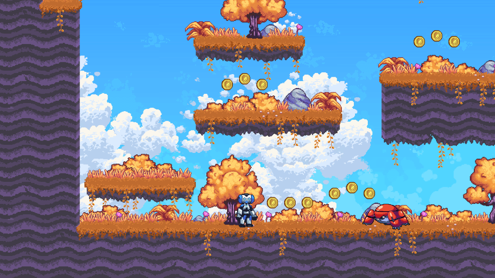

# 2D Platformer

This demo is a pixel art 2D platformer with graphics and sound.

It shows you how to code characters and physics-based objects
in a real game context. This is a relatively complete demo
where the player can jump, walk on slopes, fire bullets,
interact with enemies, and more. It contains one closed
level, and the player is invincible, unlike the enemies.

You will find most of the demo’s content in the `level.tscn` scene.
You can open it from the default `game.tscn` scene, or double
click on `level.tscn` in the `src/level/` directory.

We invite you to open the demo's GDScript files in the editor as
they contain a lot of comments that explain how each class works.

Language: GDScript

Renderer: Compatibility

Check out this demo on the asset library: https://godotengine.org/asset-library/asset/120

## Features

- Side-scrolling player controller using [`KinematicBody2D`](https://docs.godotengine.org/en/latest/classes/class_kinematicbody2d.html).
    - Can walk on and snap to slopes.
    - Can shoot, including while jumping.
- Enemies that crawl on the floor and change direction when they encounter an obstacle.
- Camera that stays within the level’s bounds.
- Supports keyboard and gamepad controls.
- Platforms that can move in any direction.
- Gun that shoots bullets with rigid body (natural) physics.
- Collectible coins.
- Pause and pause menu.
- Pixel art visuals.
- Sound effects and music.

## New Design Patterns & Systems

This project now implements three major design patterns and an enhanced parallax system:

### 1. Decorator Pattern (Power-ups)
- **SpeedBoost**: Increases movement speed by 50%
- **JumpBoost**: Increases jump height by 40%
- **ShieldPowerUp**: Provides temporary invincibility
- Multiple power-ups can be active simultaneously
- See `power_ups/` directory

### 2. Factory Pattern (Game Object Creation)
- **EnemyFactory**: Centralized enemy creation
- **PowerUpFactory**: Spawn power-up collectibles
- **CollectibleFactory**: Create coins and other collectibles
- See `factories/` directory

### 3. Strategy Pattern (Player Movement)
- **NormalMovement**: Standard player physics
- **PoweredUpMovement**: Enhanced speed and jump
- **UnderwaterMovement**: Slower movement with modified gravity
- Allows dynamic switching between movement behaviors
- See `movement_strategies/` directory

### 4. Enhanced Parallax Scrolling
- Camera-tied parallax scrolling
- Dynamic layer management
- Optional auto-scroll
- See `level/background/parallax_controller.gd`

### Demo Scripts
- `level/factory_spawner_demo.gd` - Test factory pattern (Press 1-5 to spawn objects)
- `level/movement_strategy_demo.gd` - Test movement strategies (Press F1-F3 to switch)

For detailed documentation, see [DESIGN_PATTERNS.md](DESIGN_PATTERNS.md)

## Screenshots

## Music

[*Pompy*](https://soundcloud.com/madbr/pompy) by Hubert Lamontagne (madbr)
